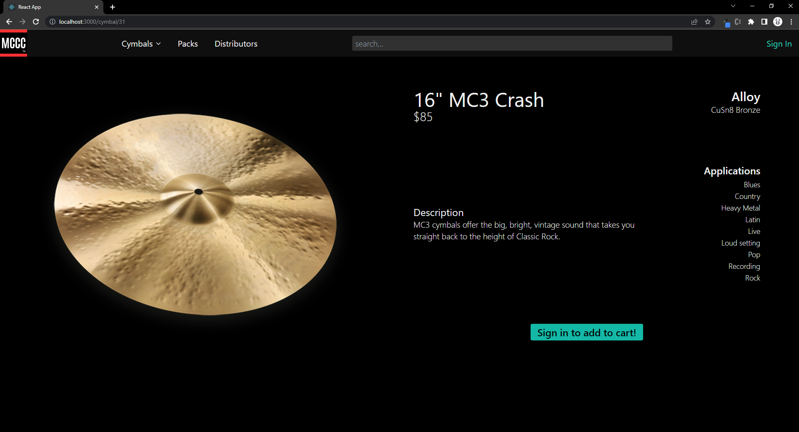
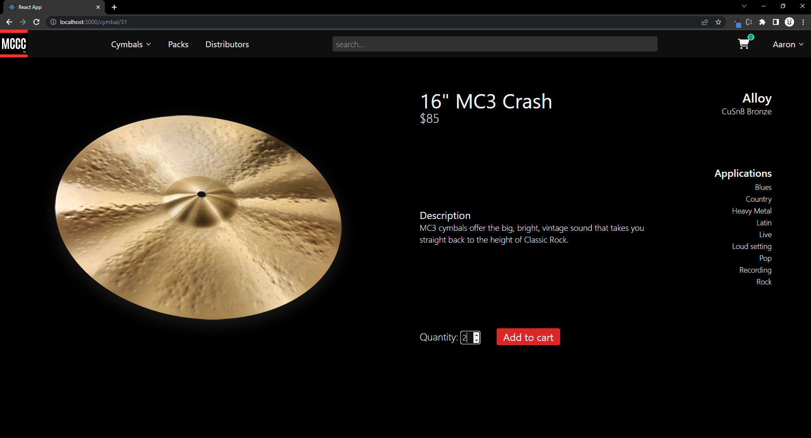

# MCCC Co.

This app was created as a final capstone while attending Nashville Software School's full-stack web development bootcamp. My goal with this project was to create a very well-rounded, "complete package" example of all of the technologies I've learned in the past 11 months.

This is a full-stack ecommerce site for an imaginary cymbal manufacturing company (Mason's Cool Cheap Cymbal Company). Users can sign in, view cymbals, add cymbals to their cart, complete orders, view order history, and edit their account information.

 

## Table of Contents

- [App Flow](#app-flow)
- [Technologies Used](#technologies-used)
- [Project ERD](#project-erd)

 

## App Flow

 

\
Navigate to cymbals page with a filter applied.

 

\
Cymbals can be filtered by both Type and Series at the same time. Here, we just have a Type filter applied.

 

\
Clicking on a cymbal card will navigate us to the details page for that cymbal. If we want to add it to our cart, we must sign in first.

 

\
This app uses Firebase auth for login/register. We'll sign in as an existing user.

 

\
After login/registration, we're redirected back to the previous route (excluding Login/Register routes). Now we can select the quantity and add the product to our cart.

 

 

\
The search bar uses a 250ms debounce function before querying the database for the top 5 most popular (measured by purchase count) cymbals matching the search criterion. Clicking one of the dropdown options navigates us to the details page for that cymbals. However, let's hit "Enter" for this search.

 

\
Here we have a search, filter, and sort in place at the same time.

 

\
MCCC Co. also sells packs of cymbals.

 

\
Clicking "Add to Cart" will add each pack item to our cart.

 

\
When viewing our cart we can delete items and update quantities.

 

\
Now we're at checkout. Since we have saved addresses, the order shipping address will automatically be set as our default address

 

\
We can view our saved addresses in the dropdown when editing our order shipping address.

 

\
Each rewards point is worth $1.

 

\
Upon order completion, we're given a randomly generated alphanumeric confirmation number. We're also given more rewards (a generous 5% of the order's total value, rounded to the nearest integer).

 

 

\
The Order History page features Flowbite accordion components.

 

\
Find a distributor near you by using the country, state, and city filters.

 

\
The account page gives us lots of CRUD capabilties, complete with error handling -- the name edit input doesn't allow empty or blank space, and...

 

...the address form has required fields in order to save/update.

 

## Technologies Used

 

## Project ERD

