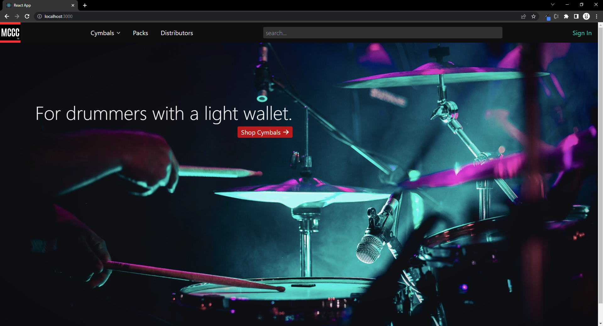

# MCCC Co.

This project is a full stack ecommerce site for a (made-up) cymbal manufacturing company. Users can sign in, view products, add products to their cart, and complete orders.

This app was created as a Backend Capstone project while attending Nashville Software School's Full Stack Web Development Bootcamp.

## Table of Contents

- [App Flow](#app-flow)
- [Features in progress](#features-in-progress)
- [Technologies Used](#technologies-used)
- [Links](#links)

## App Flow

The user is first greeted with a large splash page and navigation options.

Hovering over Cymbals in the navbar will provide filter options for more specific browsing. Clicking one of the options will navigate the user to the cymbals page with the selected filter applied.

The user can filter by both Type and Series at the same time if they wish.

Clicking on a cymbal card will navigate the user to the details page for that cymbal. Here, they can add the cymbal to their cart. In the case below, the user needs to first sign in.

This app uses firebase for login and supports both email/password and Google sign in. If they don't have an existing account, there is an option to register.

After login/registration, the user is redirected back to the page they were viewing previously. Now the user can select the quantity and add the product to their cart.

Once signed in, the navbar is updated to display a cart (with the item quantity) and a user dropdown. Clicking the cart will navigate the user to their cart.

At the cart page the user can update cart item quatities, delete cart items, and complete their order.

The user dropdown in the navbar has the option to view order history.

Here, the user can view the details of their past completed orders, including its randomly-generated alphanumeric confirmation number.

## Features in progress

- Search
- Saved
    - A page listing saved (favorited) cymbals
- Account
    - User can edit their information, including shipping address
- Rewards system
    - Each purchase earns the user rewards points, and they may use them for a discount at checkout
- Checkout
    - A page to allow customers to use rewards and enter a shipping address (or choose from saved ones) before completing their order
- Distributors
    - A page listing retailers that carry MCCC Co. cymbals

## Technologies Used

## Links

<a href="https://dbdiagram.io/d/6462ba2bdca9fb07c422425a" target="_blank">Project ERD</a>